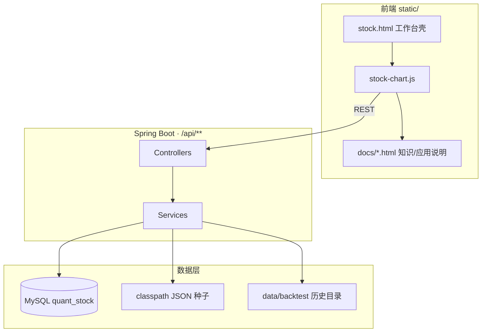
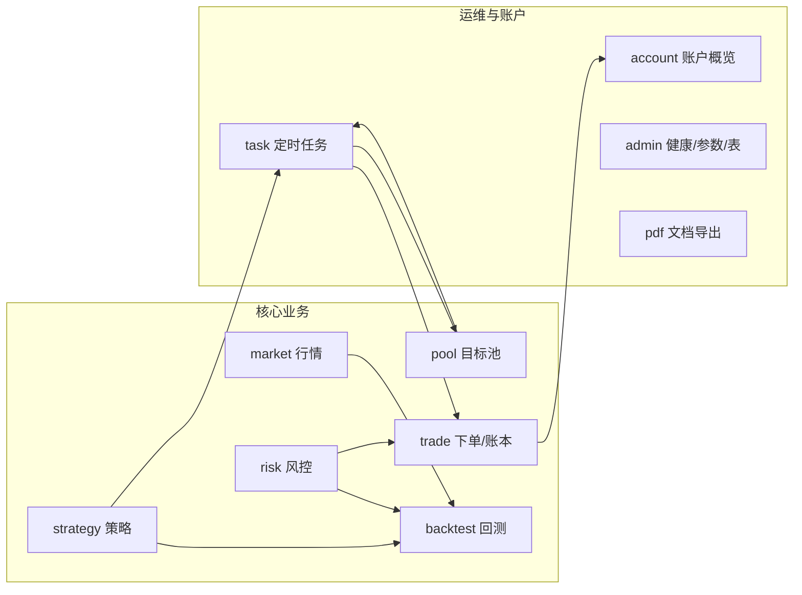
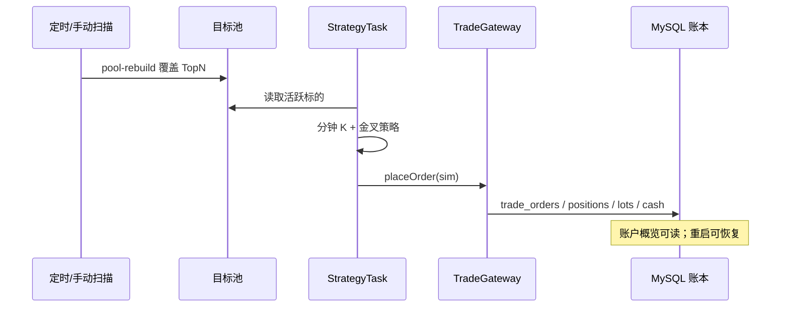

# Quant Stock · A股量化交易回测系统

基于 **Spring Boot 2.7 + TA4J** 的一体化 A 股量化回测与模拟交易工程（**非前后端分离**）。页面内嵌于 `src/main/resources/static/`，浏览器直接访问工作台即可。

| 项 | 值 |
|----|-----|
| 入口页 | http://localhost:8080/stock.html |
| 默认库 | MySQL `quant_stock`（`root` / `123456`） |
| 行情模式 | `quant.market-mode=db`：K 线读本地 MySQL（空库自动导入种子）；可选 `json` / `sdk`（外部行情桩） |
| 交易模式 | `quant.trade-mode=sim`：本地模拟账本，下单即时成交记账，不连券商；可选 `sdk`（SUBMITTED→`sync-orders`，当前仍为桩） |

---

## 快速启动

```bash
cd quant-stock
# 建库建表（Windows 示例）
"C:\Program Files\MySQL\MySQL Server 8.0\bin\mysql.exe" -uroot -p123456 < src/main/resources/mapper/schema.sql
mvn spring-boot:run
```

浏览器打开：http://localhost:8080/stock.html  

空库启动时会自动从 classpath JSON 导入日线 + 5 分钟模拟数据。默认不连 Redis（配置存在但自动配置已排除）。

页面内也可查看本文件：**应用说明 → 项目 README**（服务端实时渲染 `README.md`）。

---

## 系统架构

### 总体结构


```mermaid
flowchart TB
  subgraph UI["前端 static/"]
    StockHtml["stock.html 工作台壳"]
    ChartJs["stock-chart.js"]
    Docs["docs/*.html 知识/应用说明"]
    StockHtml --> ChartJs
    ChartJs --> Docs
  end

  subgraph API["Spring Boot · /api/**"]
    Ctrl["Controllers"]
    Svc["Services"]
    Ctrl --> Svc
  end

  subgraph Data["数据层"]
    MySQL[(MySQL quant_stock)]
    Json["classpath JSON 种子"]
    Hist["data/backtest 历史目录"]
  end

  ChartJs -->|REST| Ctrl
  Svc --> MySQL
  Svc --> Json
  Svc --> Hist
```

### 后端模块（`com.quant.stock`）


```mermaid
flowchart LR
  subgraph Core["核心业务"]
    Market["market 行情"]
    Strategy["strategy 策略"]
    Backtest["backtest 回测"]
    Pool["pool 目标池"]
    Trade["trade 下单/账本"]
    Risk["risk 风控"]
  end

  subgraph Ops["运维与账户"]
    Account["account 账户概览"]
    Task["task 定时任务"]
    Admin["admin 健康/参数/表"]
    Pdf["pdf 文档导出"]
  end

  Market --> Backtest
  Strategy --> Backtest
  Strategy --> Task
  Pool --> Task
  Trade --> Account
  Risk --> Backtest
  Risk --> Trade
  Task --> Trade
  Task --> Pool
```

| 包 | 职责 |
|----|------|
| `market` | K 线统一入口：MySQL → Redis → JSON → mock/SDK |
| `strategy` | 策略注册表 `StrategyRegistry` + 单活 `quant.active-strategy`（默认 `maCross` 金叉；可切换如 `holdNothing`） |
| `backtest` | 单股/组合引擎、批量扫描、历史与分析落盘 |
| `pool` | 唯一目标池：盘后扫描覆盖、打分、报告 |
| `trade` | 交易网关、成本模型、模拟账本落库 |
| `risk` | 开仓过滤、涨跌停、账户熔断、风控日志 |
| `account` | 账户概览只读汇总 |
| `task` | `sys_schedule_job` 动态调度 + `StrategyTask` |
| `admin` | 数据健康、运行参数、表白名单浏览 |
| `pdf` | 知识/应用说明 PDF；README Markdown→HTML |
| `calendar` | 静态交易日历（按上交所公告维护节假日） |
| `config` / `controller` / `mapper` | 配置、REST、MyBatis |

### 功能闭环（模拟实盘）


```mermaid
sequenceDiagram
  participant Sched as 定时/手动扫描
  participant Pool as 目标池
  participant Strat as StrategyTask
  participant GW as TradeGateway
  participant DB as MySQL 账本

  Sched->>Pool: pool-rebuild 覆盖 TopN
  Strat->>Pool: 读取活跃标的
  Strat->>Strat: 分钟 K + 金叉策略
  Strat->>GW: placeOrder(sim)
  GW->>DB: trade_orders / positions / lots / cash
  Note over DB: 账户概览可读；重启可恢复
```

---

## 功能模块说明

### 1. 行情浏览

- 全市场列表来自 `stock_basic`；工作台内**代码/名称模糊选股**，多标签切换
- 多周期 K 线（日线物理表；其它周期运行时聚合）+ MA / BOLL / RSI 等
- 统一查询：`MarketDataService#getKline`

### 2. 个股回测

| 二级菜单 | 功能 |
|----------|------|
| 回测工作台 | 选股、周期、区间（空=全量）、初始资金 → 运行回测，K 线信号 + 权益 |
| 批量扫描 | 股票池批量摘要，可筛「仅可买入」 |
| 回测历史 | 落盘记录与分析；可跨股查看 |

引擎：`BackTestEngine`（次日开盘撮合、止损/移动止盈、金字塔、T+1 分档、账户熔断）。

### 3. 组合回测

| 二级菜单 | 功能 |
|----------|------|
| 回测工作台 | 多选成分股、共享资金池、强制日 K |
| 回测历史 | 组合历史与分析 |

引擎：`PortfolioBackTestEngine`；展示权益、成交流水、分股表现。

### 4. 目标池（唯一池）

| 二级菜单 | 功能 |
|----------|------|
| 当前池 | 查看入选、移出（**移出≠卖出**）、手动「扫描更新」 |
| 扫描历史 | 批次与报告；亦可手动扫描 |

- 盘后任务 `pool-rebuild` / `after-market-batch-scan` 自动覆盖 `trade_pool`
- 打分：均线趋势 / MA60 / ADX / 动量 / ATR / 流动性（默认 ≥ `pool-score-min`）

### 5. 账户概览

资金权益 · 持仓（批次 T+1）· 委托 · 权益日结 · 风控事件。  
数据来自本地模拟账本表（非真实柜台）。

### 6. 运维中心

| 二级 | 功能 |
|------|------|
| 任务管理 | `sys_schedule_job` 启停 / cron / 立即执行（种子默认全关） |
| 数据健康 | 本地空数据与滞后检查 |
| 运行参数 | `QuantProperties` + 配置键中文说明 |

总闸：`quant.schedule.enabled`（默认 true）。

### 7. 数据表

白名单表分页只读浏览（`DbTableCatalog`）。

### 8. 量化知识 / 应用说明

- **量化知识**：A 股基础、指标、涨跌停、T+1、成本、仓位、风控、撮合、回测要点等
- **应用说明**：系统概述 → **项目 README** → 交易规则 → 能力与待办 → 宽睿文档梳理
- 介绍页可导出 PDF：`GET /api/docs/pdf/{stock|app}`
- 在线 README：`GET /api/docs/readme`

---

## 页面与导航

- 进入应用先显示**初始化页**（`docs/home.html`）；侧栏一级菜单互斥展开，再点同一菜单收起并回初始化页
- 展开一级菜单先显示介绍页（`docs/nav-*.html`），再点二级进入工作台/文档
- 工作台顺序：**行情** → **个股回测** → **组合回测** → **目标池** → **账户** → **运维中心** → **数据表** → **量化知识** → **应用说明**
- 页头主题（`localStorage`）：日间（默认）/ 夜盘 / 银河 / 极光

---

## 模拟数据 / 行情表

- 种子目录：`src/main/resources/data/kline/`（仅导入用）
- 演示股：600036 招商银行、000001 平安银行、300059 东方财富
- 区间：约 `2025-07-17` ~ `2026-07-17`
- **物理表**：`market_daily`（日线）、`market_minute`（5 分钟）
- 回测历史/分析：`bt_backtest_record` / `bt_backtest_analysis`（亦可落盘 `quant.history-dir`）
- 重新生成种子：`mvn -q compile exec:java -Dexec.mainClass=com.quant.stock.market.mock.MockKlineDataGenerator`

### 主要库表

| 表 | 用途 |
|----|------|
| `stock_basic` | 标的档案 |
| `market_daily` / `market_minute` | 日线 / 5 分钟 |
| `trade_pool` / `trade_pool_report` | 唯一目标池与报告 |
| `trade_orders` / `trade_positions` / `trade_position_lots` / `trade_cashflows` | 模拟委托、持仓、批次、日结 |
| `risk_control_log` | 风控日志 |
| `sys_schedule_job` | 定时任务 |
| `bt_backtest_record` / `bt_backtest_analysis` | 回测历史与分析 |
| `system_config` | 动态配置（含模拟现金等） |

---

## 安全与运维配置

| 配置 / 环境变量 | 说明 |
|----------------|------|
| `spring.datasource.*` | 默认 `localhost:3306/quant_stock`，`root` / `123456`（本地演示，勿用于公网） |
| `QUANT_API_KEY` / `quant.api-key` | 非空则 `/api/**` 需 `X-API-Key`（`/api/config` 等除外） |
| `QUANT_RATE_LIMIT` / `quant.rate-limit-per-minute` | 回测/组合/批量每 IP 每分钟上限（默认 30，≤0 关闭） |
| `quant.schedule.enabled` | 定时总闸（默认 true；各任务以库表为准） |
| `quant.trade-mode` | `sim`（默认）本地模拟、即时 FILLED 并记账，不连柜台；`sdk` 先 SUBMITTED（占资/占仓），`sync-orders` 推进 FILLED 后再落账（当前为桩） |
| `quant.market-mode` | `db`（默认）读本地行情表；`json` 读 classpath JSON；`sdk` 走 `KlineSdkClient`（多为桩，宽睿 MDS 未接主路径） |

---

## 主要接口

| 接口 | 说明 |
|------|------|
| GET `/api/config` | 公开配置 |
| GET `/api/stock/pool` | 标的/股票池 |
| GET `/api/kline?code=&period=` | 统一周期 K 线 |
| GET `/api/backtest/run` | 单只回测 |
| GET `/api/backtest/history` · `/analysis` | 个股历史与分析 |
| GET `/api/batch/scanAllStock` | 批量扫描 |
| POST `/api/portfolio/run` | 组合回测 |
| GET `/api/portfolio/history` · `/analysis` | 组合历史与分析 |
| GET `/api/stock/universe` | 全市场 |
| GET/POST `/api/stock/trade-pool*` | 目标池查询/重建/移出/报告 |
| GET `/api/account/**` | 账户资金/持仓/委托/日结/风控；页面「风控日报」聚合 alerts/turnover/ic-decay 等 |
| GET `/api/account/alerts` | 风控告警环形缓冲（分级+冷却） |
| GET `/api/account/slippage-residual` | 滑点/费用残差日报（不回写改价） |
| GET `/api/account/partial-fill` | 部成率日报 |
| GET `/api/account/stress` | 预注册压力情景状态 |
| GET `/api/account/signal-drift` | 信号漂移（滚动胜率/IC） |
| GET `/api/account/structural-break` | 结构突变监控 |
| GET/POST `/api/ops/data-reconcile*` | 多源对账闸（日线 vs 分钟聚合） |
| GET/POST `/api/ops/st-pit` | ST as-of 日切；财报时钟边界说明 |
| GET/POST `/api/ops/industry-reclass*` | 行业 reclass as-of 日志 |
| GET `/api/account/turnover` | 换手门禁（日成交额/权益） |
| GET `/api/account/ic-decay` | IC 衰减（半衰期/IR；只降仓） |
| GET `/api/account/short-policy` | 禁空头边界（多头现货） |
| GET `/api/account/order-protect` | 限价保护边界（无五档/L2） |
| GET `/api/account/execution-cap` | AUM/POV 执行边界（无 TWAP） |
| POST `/api/account/orders/{id}/cancel` | 撤销 SUBMITTED/PARTIAL |
| POST `/api/account/orders/{id}/partial-fill?qty=` | 本地部成桩 |
| POST `/api/account/orders/{id}/replace?price=&volume=` | 改价=撤补（新单队尾） |
| GET/PUT/POST `/api/schedule/**` | 定时任务 |
| GET `/api/ops/data-health` · `/params` | 数据健康 / 运行参数 |
| GET `/api/db/tables` · `/tables/{name}` | 表白名单浏览 |
| GET `/api/docs/pdf/{stock\|app}` | 文档 PDF |
| GET `/api/docs/readme` | README HTML 片段 |

---

## 运维中心 · 定时任务

- 表：`sys_schedule_job`（启动自动建表+种子，**默认全关**）
- **唯一目标池**：`pool-rebuild` / `after-market-batch-scan` 扫描后覆盖；启用其一会自动关闭另一（互斥）
- `scan-and-trade`：只扫池内活跃标的 + 本地模拟账本
- 已实现：`scan-and-trade` / `pool-rebuild` / `after-market-batch-scan` / `settle-after-close` / `data-validate` / `sync-orders` / `position-pnl-sync`
  - `settle-after-close`：权益日记最近交易日；分钟落 `market_minute`，再聚日线写 `market_daily`（更大周期查询时内存聚合）
  - `sync-orders`：本地桩将 `SUBMITTED→FILLED` 并改仓；`trade-mode=sdk` 时策略在 sync 后才落现金/批次
  - `position-pnl-sync`：本地成本 + 最新价浮盈日志
- 页面标「未实现」（缺外部 API）：`market-collect`
- 对照：**应用说明 → 能力与待办**；宽睿对接：**应用说明 → 宽睿文档梳理**（分阶段：环境→MDS L1→OES 只读→报撤→静态/费率）
- 宽睿 **M0**：`config/kuangrui/README.md` + `scripts/kuangrui/m0-env-check.ps1`；本应用联通测试 `mvn -Pkuangrui test -Dtest=KuangruiLoginConnectivityTest`（对齐 Demo 登录，可复现 Pre Logon `1045`）。阿里云 TCP 已通但预登录仍 BLOCKED；主应用默认仍 `sim`+`db`

---

## 策略与风控（已实现）

- **单活策略可切换**：`quant.active-strategy` 默认 **`maCross`**（均线金叉死叉 + MA60/放量/ADX/RSI 过滤，实现仍在 `MaCrossStrategy`，不静默改规则）。回测/扫池/`StrategyTask` 共用 `StrategyRegistry.active()` 与一套账本/目标池。新策略：新建 `@Component` 继承 `BaseStrategy` 后改配置即可；占位 `holdNothing` 永不交易。运维「运行参数」展示当前策略；单股/组合回测可选 `strategyId`（缺省=配置）
- 止损：相对综合成本的 ATR + 权益硬止损；移动止盈盘后上移；**跳空穿价按开盘价**成交（盘中触及按止损价）
- 组合相关监控：成分日收益两两相关（回看 60 日，均值≥0.75 告警）；组合回测结果字段 `correlation`；`GET /api/account/correlation`
- **T+1 分档**：仅非当日买入批次可卖/可止损
- 金字塔 50/30/20（成交后占档；总仓 ≤80%）
- 开仓过滤：涨跌停 / 停牌 / 流动性 / 市值 / 静默时段
- 账户熔断：单日亏损、连亏、回撤**深度**降仓/停机 + **持续期**降仓/熔断（低于峰值满 N/M 交易日；默认 10/30，0=关单项）
- 策略退役：持续期熔断可自动退役（`auto-retire-on-duration-halt`）；冷却默认 20 交易日；强制恢复需**双人复核**（武装令牌 + `confirmCode`）；`GET/POST /api/account/retirement*`
- 组合回测对齐：部成残量、AUM+POV、ADV断崖/结构突变降仓、ST as-of 限价、结果含 `atrRisk`
- 撮合：日 K → 下一根开盘；分钟 → ≥次日 09:45
- 成本：佣金（含最低 5 元）、印花税、分级滑点、冲击成本
- 单笔 ADV 参与率硬顶：`quant.max-participation-adv` 默认 **0.10**（止损/熔断卖出不受限）
- 回测结果附带 `configFingerprint`（策略相关 quant.* 的 v1 哈希；含 `experiment-seed` 实验种子字段，默认空）
- 退出优先级契约：止损/trail（当根）> 回撤熔断挂卖 > 时间止损挂卖 > 死叉挂卖（`ExitPriority`）
- 时间止损：`quant.max-hold-trading-days` 默认 **0（关闭）**；到期挂清仓（不受 ADV 参与率限制）
- 纸面-实盘对账：`GET /api/account/paper-live-gap`；账户概览 →「纸面对账」（闪烁/成本残差/选股/撮合假设；非真柜台）
- 告警分级冷却：`RiskAlertService`；软预算线默认总仓 70%/单票 25%（仅 WARN）；熔断/退役 CRITICAL；`GET /api/account/alerts`
- 滑点残差日报：`GET /api/account/slippage-residual`（对照委托价与费用模型；不静默改滑点配置）；纸面对账摘要含 `avgAbsAdverseBps`
- 限价保护：`quant.limit-price-protect-enabled` 默认 **true**（买≤涨停/卖≥跌停夹紧；无五档盘口，配合 ADV 帽）
- 回测部成：`quant.backtest-fill-ratio` 默认 **1**（满额）；&lt;1 时本 bar 按比例成交、残量保留挂单；`GET /api/account/partial-fill`
- 压力情景：预注册 ADV 断崖/一字板/相关尖峰等；`stress-adv-cliff-ratio` 默认 0.40 → 仓位×0.5；`GET /api/account/stress`（不改金叉）
- 信号漂移：滚动胜率 + MA 价差**代理** IC（`icSource=MA_SPREAD_PROXY`；真因子/截面 IC=`UNAVAILABLE`）；确认后 CRITICAL；`auto-retire-on-signal-drift` 默认 **false**；`GET /api/account/signal-drift`
- ATR 一体契约：回测结果字段 `atrRisk`（倍数/硬止损/夹紧/止损事件数）；定仓 ATR 调节 0.2~1.5
- 禁空头：`ShortSellPolicy.allowShort=false`（无配置开关）；卖出≤持仓；`GET /api/account/short-policy`
- 限价保护边界：`GET /api/account/order-protect`（五档/L2=`UNAVAILABLE`）
- 执行降频边界：组合回测已对齐 AUM+POV；`GET /api/account/execution-cap`（TWAP=`UNAVAILABLE`）
- 多源对账：日线↔分钟聚合；`externalVendorSource=UNAVAILABLE`；行业 reclass：`externalIndustrySource=UNAVAILABLE`
- 多源对账闸：日线 vs 分钟聚合收盘分歧；`data-reconcile-block-on-diverge` 默认 **false**（只告警）；`GET/POST /api/ops/data-reconcile*`；外部行情对账仍待 API
- 扩容降频：权益超 `capacity-aum-base`（默认 10万）时收紧 ADV 参与率；`pov-max-bar-volume-pct` 默认 0.10（当根量 POV 切片）
- 结构突变：双窗收益均值差；确认后降仓×0.5 并挂漂移；`GET /api/account/structural-break`（不改金叉）
- ST as-of：`st_status_hist` 日切优先；`st-open-filter-enabled` 默认 true 禁开 ST；财报公告时钟本地无数据（边界已声明）
- 换手 L1：日成交额/权益软顶 50% 降仓、硬顶 100% 禁开；印花税按成交日 as-of（2023-08-28 起 0.05%）
- IC 衰减：滚动 IC（MA 价差代理）半衰期/IR；触发后仓位×0.5；`GET /api/account/ic-decay`（真因子 IC 仍待）
- 改价撤补：`POST /api/account/orders/{id}/replace` = 撤旧+新 clientOrderId 重报（队尾重置，不保优先级）
- 行业 reclass 日志：`industry_reclass_log`；`GET/POST /api/ops/industry-reclass*`（不并金叉）
- 涨跌停：主板 10% / 创科 20%（`LimitBoardHelper`）；ST 按 as-of 用 5% 限幅

细则见页面「应用说明 → 交易规则」。

---

## 扩展点

- `KlineSdkClient` / `NoopKlineSdkClient` — 行情 SDK（`market-mode=sdk`）
- `TradeGatewayService` — 券商 SDK（`trade-mode=sdk` 桩；真对接见宽睿 OES/MDS 资料）
- `BarStorageService#rebuildPeriod` — 聚合表修复

---

## 已知限制

- 行情/券商 SDK 默认为 Noop；生产需接真实行情与柜台（可参考宽睿 Quant360）
- 市值无交易所接口时依赖 `float-shares-yi` 或启发式
- 实盘路径为模拟现金账本（现金=0 可恢复；风控/退役/挂单元数据落库；信号日≠成交日）；`sdk` 下单为 SUBMITTED（预留资金/可卖量），`sync-orders` 确认 FILLED 后再改现金与批次；重启重建未完结委托；熔断/时间止损可抢占死叉挂卖；成交时按仓位系数缩量；停牌拒卖；ST as-of 跌停强平；运维「执行一次」对 scan/sync/settle 锁忙 failLoud
- 复权/财报/舆情等见「能力与待办」

---

## 维护约定

每次实质性改动需**同时**更新：

1. 本 `README.md`
2. 「应用说明 → 系统概述」（`static/docs/app.html`）
3. 规则变更 → 「交易规则」（`rules.html`）
4. 能力/待办 → 「能力与待办」（`memo.html`；待对接置顶，已落地默认折叠）
5. 宽睿资料 → 「宽睿文档梳理」（`kuangrui.html`）

规则：`.cursor/rules/sync-readme.mdc`、`.cursor/rules/sync-memo.mdc`。
