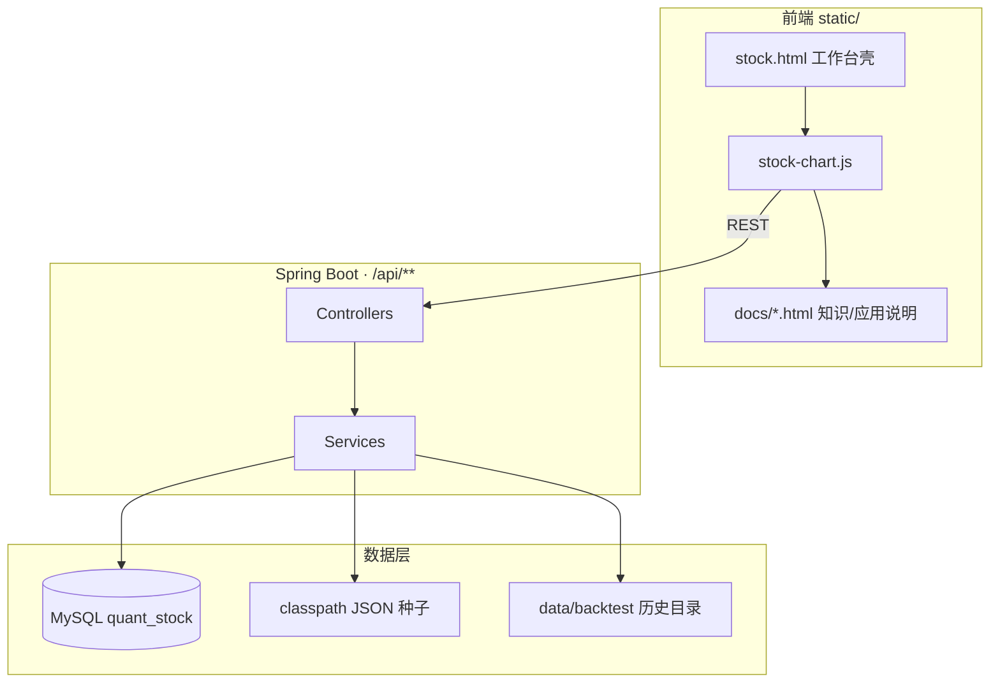
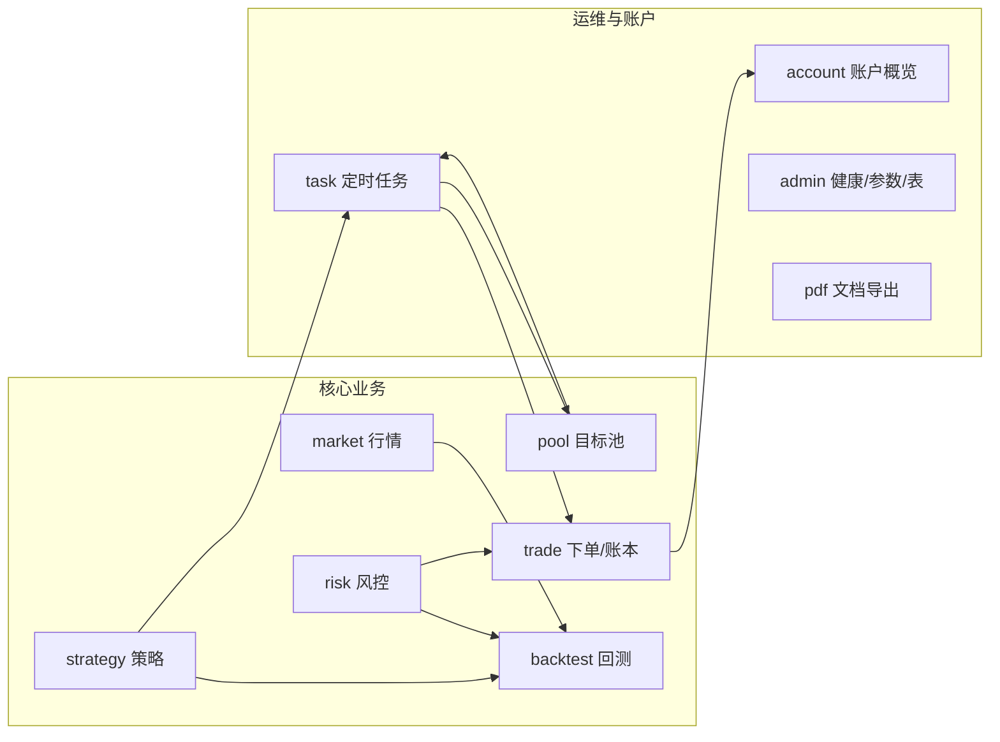
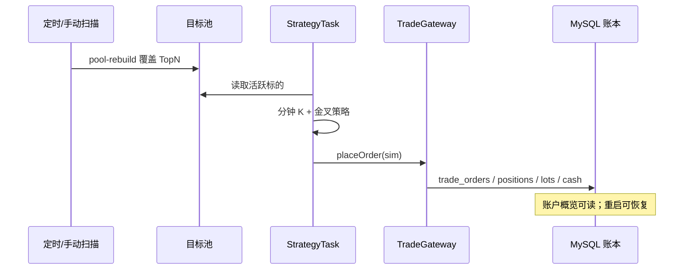

# Quant Stock · A股量化交易回测系统

基于 **Spring Boot 2.7 + TA4J** 的一体化 A 股量化回测与模拟交易工程（**非前后端分离**）。页面内嵌于 `src/main/resources/static/`，浏览器直接访问工作台即可。浏览器标签页图标为 `static/favicon.ico`（ZSW）；工作台顶栏 Logo 为 `static/images/logo.png`（透明底；另存 `logo-black.png` / `logo-navy.png` 备用）。

| 项 | 值 |
|----|-----|
| 入口页 | http://localhost:8080/stock.html |
| 默认库 | MySQL `quant_stock`（`root` / `123456`） |
| 行情模式 | `quant.market-mode=db`：K 线读本地 MySQL（空库自动导入种子）；可选 `json` / `sdk`（外部行情桩） |
| 交易模式 | `quant.trade-mode=sim`：本地模拟账本，下单即时成交记账，不连券商；可选 `sdk`（SUBMITTED→`sync-orders`，当前仍为桩） |

---

## 快速启动

```bash
cd quant-stock
# 建库建表（Windows 示例）
"C:\Program Files\MySQL\MySQL Server 8.0\bin\mysql.exe" -uroot -p123456 < src/main/resources/mapper/schema.sql
mvn spring-boot:run
```

浏览器打开：http://localhost:8080/stock.html  

空库启动时会自动从 classpath JSON 导入 **1 分钟**模拟数据到 `market_1min`（优先 `MIN_1.json`，否则由 `MIN_5.json` 拆分）。默认不连 Redis（配置存在但自动配置已排除）。

**配置分层**：`application.yml` 为仓库基线（宽睿开关默认关）；默认激活 profile **`local`**，加载 `application-local.yml`（本仓库已开宽睿旁路开关，**不含账号**）。真客户端仍需 `mvn -Pkuangrui`（或 IDEA 勾选同名 profile）+ `config/kuangrui/local`；账号优先「宽睿对接 → 账号登录」验柜入库，否则环境变量。关闭本机覆盖：`--spring.profiles.active=default` 或设 `SPRING_PROFILES_ACTIVE`。

页面内也可查看本文件：**应用说明 → 项目 README**（服务端实时渲染 `README.md`）。

---

## 系统架构

### 总体结构


```mermaid
flowchart TB
  subgraph UI["前端 static/"]
    StockHtml["stock.html 工作台壳"]
    ChartJs["stock-chart.js"]
    Docs["docs/*.html 知识/应用说明"]
    StockHtml --> ChartJs
    ChartJs --> Docs
  end

  subgraph API["Spring Boot · /api/**"]
    Ctrl["Controllers"]
    Svc["Services"]
    Ctrl --> Svc
  end

  subgraph Data["数据层"]
    MySQL[(MySQL quant_stock)]
    Json["classpath JSON 种子"]
    Hist["data/backtest 历史目录"]
  end

  ChartJs -->|REST| Ctrl
  Svc --> MySQL
  Svc --> Json
  Svc --> Hist
```

### 后端模块（`com.quant.stock`）


```mermaid
flowchart LR
  subgraph Core["核心业务"]
    Market["market 行情"]
    Strategy["strategy 策略"]
    Backtest["backtest 回测"]
    Pool["pool 目标池"]
    Trade["trade 下单/账本"]
    Risk["risk 风控"]
  end

  subgraph Ops["运维与账户"]
    Account["account 账户概览"]
    Task["task 定时任务"]
    Admin["admin 健康/参数/表"]
    Pdf["pdf 文档导出"]
  end

  Market --> Backtest
  Strategy --> Backtest
  Strategy --> Task
  Pool --> Task
  Trade --> Account
  Risk --> Backtest
  Risk --> Trade
  Task --> Trade
  Task --> Pool
```

| 包 | 职责 |
|----|------|
| `market` | K 线统一入口：MySQL → Redis → JSON → mock/SDK |
| `strategy` | 策略注册表 `StrategyRegistry` + 单活 `quant.active-strategy`（默认 `maCross` 金叉；可切换对照画像或 `overnightGap`） |
| `backtest` | 单股/组合引擎、批量扫描、历史与分析落盘 |
| `pool` | 唯一目标池：盘后扫描覆盖、打分、PDF 报告 |
| `trade` | 交易网关、成本模型、模拟账本落库 |
| `risk` | 开仓过滤、涨跌停、账户熔断、风控日志 |
| `account` | 账户概览只读汇总 |
| `task` | `sys_schedule_job` 动态调度 + `StrategyTask` |
| `admin` | 数据健康、运行参数、表白名单浏览 |
| `pdf` | 知识/应用说明 PDF；目标池扫描报告 PDF；README Markdown→HTML |
| `calendar` | 静态交易日历（按上交所公告维护节假日） |
| `config` / `controller` / `mapper` | 配置、REST、MyBatis |

### 功能闭环（模拟实盘）


```mermaid
sequenceDiagram
  participant Sched as 定时/手动扫描
  participant Pool as 目标池
  participant Strat as StrategyTask
  participant GW as TradeGateway
  participant DB as MySQL 账本

  Sched->>Pool: pool-rebuild 覆盖 TopN
  Strat->>Pool: 读取活跃标的
  Strat->>Strat: 分钟 K + 金叉策略
  Strat->>GW: placeOrder(sim)
  GW->>DB: trade_orders / positions / lots / cash
  Note over DB: 账户概览可读；重启可恢复
```

---

## 功能模块说明

### 1. 行情浏览

- 全市场列表来自 `stock_basic`；工作台内**代码/名称模糊选股**，多标签切换
- 多周期 K 线（日线物理表；其它周期运行时聚合）+ MA / BOLL / RSI 等
- 统一查询：`MarketDataService#getKline`

### 2. 个股回测

| 二级菜单 | 功能 |
|----------|------|
| 回测工作台 | **仅从目标池**选股；周期、区间（空=全量）、初始资金、策略 → 运行回测，K 线信号 + 权益 |
| 批量扫描 | 配置标的列表批量摘要，可筛「仅可买入」（仍读 yml `stock-codes`，非目标池） |
| 回测历史 | 落盘记录与分析；可跨股查看 |

引擎默认 `BackTestEngine`（`engine=classic`：次日开盘撮合、止损/移动止盈、金字塔、T+1 分档、账户熔断）。  
可选旁路 **`SessionBackTestEngine`**（`engine=session` 或策略实现 `SessionStrategy` 如 **`overnightGap`**）：强制 **MIN_1** 三分支（OPEN/MID/CLOSE，窗口见 `quant.session.*`）+ 持仓日态事件 + **撮合子集**（`pollIntents` → 费用/T+1/涨跌停夹紧/ADV；`quant.session.fill-mode` 默认 **`AUTO`**：跟随 `next-bar-open-fill`→`NEXT_EFFECTIVE`（挂单，次日且分钟≥09:45 按开盘价）或 `BAR_CLOSE`（当根收盘即时））+ 分分支绩效（`sessionBranchStats`）与事件表。缺 INDEX/竞价/封单时分支 `UNAVAILABLE`（`failOnMissingDep=true` 可整单失败）。
纸面：`quant.session.paper-enabled=true`（默认）且激活策略实现 `SessionStrategy` 时，`scan-and-trade` 经 `SessionPaperAdaptor` 走会话钩子，意图转为挂买/挂卖后仍走原模拟账本撮合；金叉激活时行为不变。组合 `engine=session` 经 `SessionPortfolioBackTestEngine` 为 **MIN_1 共享资金池**（统一现金 + `AccountRiskState`/单票总仓/压力降仓/AUM+POV，熔断挂卖，无金叉五步；结果含 `sessionEvents` 与日收益相关摘要）。**隔日高开三分支**见策略 `overnightGap`（阈值 `quant.session.overnight-gap.*`）。

### 3. 组合回测

| 二级菜单 | 功能 |
|----------|------|
| 回测工作台 | **仅从目标池**多选成分股、共享资金池、强制日 K |
| 回测历史 | 组合历史与分析 |

引擎：`PortfolioBackTestEngine`（默认日 K **共享资金池**）。  
`engine=session` 或 `SessionStrategy`（如 `overnightGap`）：MIN_1 **共享资金池**旁路（并集分钟轴 + 统一现金/账户风控/熔断；`sessionBranchStats.mode=SHARED_CASH_SESSION`；工作台展示会话事件面板）；仍无金叉五步。

### 4. 目标池（唯一池）

| 二级菜单 | 功能 |
|----------|------|
| 当前池 | 查看入选、移出（**移出≠卖出**）、手动「扫描更新」（提交 `pool-rebuild` 异步任务 + 进度弹框）、下载 PDF 报告 |
| 扫描历史 | 批次与报告；亦可手动扫描 |

- 盘后任务 `pool-rebuild` / `after-market-batch-scan` 自动覆盖 `trade_pool`，并落盘 `historyDir/reports/pool-yyyyMMdd-HHmmss.pdf`
- 「下载报告」：`GET /api/stock/trade-pool/reports/{fileName}`（`Content-Type: application/pdf`；兼容历史 `.md`）
- 打分：均线趋势 / MA60 / ADX / 动量 / ATR / 流动性（默认 ≥ `pool-score-min`）
- **个股/组合回测工作台选股只读本池**（行情浏览仍为全市场）

### 5. 账户概览

资金权益 · 持仓（批次 T+1）· 委托 · 权益日结 · 风控事件。  
数据来自本地模拟账本表（非真实柜台）。

### 6. 运维中心

| 二级 | 功能 |
|------|------|
| 任务管理 | `sys_schedule_job` 启停 / cron / 立即执行（种子默认全关；执行一次弹进度框+页内横幅，可「收起到页内」；长任务 `i/n`） |
| 数据健康 | 覆盖检查（异步进度；待处置告警 vs 特殊项分表；北交所空/退市·PT/停牌不计入待处置）+ 分钟自洽 + MDS/TDX 抽样对账（默认不阻断开仓） |
| 运行参数 | 全局白名单可写（`quant.prop.*`）+ **按策略稀疏参数包**（表 `strategy_param`）；回测还可带 **本次临时改参**（`paramOverrides`，不落库） |

总闸：`quant.schedule.enabled`（默认 true）。

### 7. 策略管理

| 二级 | 功能 |
|------|------|
| 策略总览 | 注册策略列表（含介绍、满分 100 综合评分）+ 聚合指标与回测历史；历史表可筛全部/单股/组合，点行展开详情 |

- **职责分离**：本菜单只做效果总览与评分；全局/按策略改参、纸面激活切换仍在 **运维中心 → 运行参数**
- 数据：`GET /api/strategy/overview`（含 `detailIntro`、加权 `score`/`scoreComponents`、`avgSharpe`）、`GET /api/strategy/{id}/history?kind=`、`GET /api/strategy/history/{recordId}`；按注册 `strategy_id` 聚合（查询含历史别名如 `MaCrossStrategy`）；启动自动补全空白→`maCross`、旧名→注册 id；运维 `POST /api/ops/backtest/backfill-strategy-id`；overview 仍可含 `unknownCount`
- **评分（满分 100）**：收益 30 + 回撤 25 + 胜率 20 + 盈利占比 15 + 样本 10；无回测则不评分；样本少时仅供对照
- **夏普（仅展示）**：落库时由权益曲线算年化夏普（无风险利率=0；日线 √252 等）；overview 给 `avgSharpe`，历史表有「夏普」列；**不计入**综合评分；旧回测无该列则为空
- **无回测补种**：选中 `runCount=0` 的策略时自动（亦可手动）`POST /api/strategy/{id}/seed-pool-backtest`：对目标池活跃股逐只单股回测 + 全池组合回测一次（初始资金默认 10 万；经典策略用日线，`SessionStrategy` 如 `overnightGap` 走 session）；进度 `GET /api/strategy/seed-status`；已有记录需 `force=true`

### 8. 数据表

白名单表分页只读浏览（`DbTableCatalog`）。列表与详情附带 **磁盘占用**（`information_schema` 的 DATA/INDEX；InnoDB 约为已分配空间）：侧栏显示总量徽章，工具栏摘要与表说明展开区显示数据/索引分项。

### 9. 宽睿对接

侧栏「扩展与文档」一级菜单（工作台之后、量化知识之前）：点测 OES/MDS 运维接口（入参/出参 JSON）+ 二级「宽睿文档梳理」。

| 二级 | 功能 |
|------|------|
| 接入总览 | 账号凭据 / MDS / OES / 报撤 / 静态状态卡（LIVE 徽章、中文键值、hint、原始 JSON）+ 快捷入口 |
| 账号登录 | 页顶按钮 + 左侧 API 卡「查询当前账号」→ `GET /api/ops/kuangrui/account/current`（`currentUsername`，无密码）；登录先验柜再密文入库；取密 **DB active 优先**，否则 env；主密钥表 `kuangrui_crypto_key`（两表不进数据表白名单） |
| OES 只读 | 左窄列表（「介绍」弹层摘要 +「调用」）；右侧入参/出参更宽（出参旁「复制出参」）；资金/持仓/委托/成交/快照/对账/证券/交易日/佣金/总览/股东账户/主柜资金/可买量/stop |
| MDS 行情 | 同上布局；状态/静态/证券状态/时段/合并静态；pull·subscribe·flush·stop（写操作二次确认） |
| 报撤试单 | 左表单（含介绍）+ 右侧结果（可一键复制出参）；`place-test`/`cancel-test`；须 `orderLive`；页面二次确认 |

默认旁路关闭；不改金叉主路径。对接手册见「宽睿对接 → 宽睿文档梳理」；联调页「介绍」可跳转该文档。

### 10. 量化知识 / 应用说明

- **量化知识**：A 股基础、指标、涨跌停、T+1、成本、仓位、风控、撮合、回测要点等
- **应用说明**：系统概述 → **项目 README** → 交易规则 → 能力与待办
- **宽睿对接**：联调点测 + **宽睿文档梳理**
- 介绍页可导出 PDF：`GET /api/docs/pdf/{stock|app}`
- 在线 README：`GET /api/docs/readme`

---

## 页面与导航

- 进入应用先显示**初始化页**（`docs/home.html`）；入口按钮与侧栏一级菜单自动对齐（含策略管理/数据表/宽睿对接等）；侧栏一级菜单互斥展开，再点同一菜单收起并回初始化页
- 展开一级菜单先显示介绍页（`docs/nav-*.html`），再点二级进入工作台/文档
- 工作台顺序：**行情** → **个股回测** → **组合回测** → **目标池** → **账户** → **运维中心** → **策略管理** → **数据表**
- 扩展与文档：**宽睿对接**（联调点测 + 文档梳理） → **量化知识** → **应用说明**
- 页头主题（`localStorage`）：浪花（默认日间：左下起浪、右渐高 + 飞沫）/ 夜盘 / 银河

---

## 模拟数据 / 行情表

- 种子目录：`src/main/resources/data/kline/`（仅导入用）
- 演示股：classpath 十只近一年模拟种子（空库启动灌 `market_1min`）；目标池可用 `scripts/fetch_min1_tdx.py --from-pool` 回填约 90 交易日 1 分钟
- 区间：classpath 模拟种子为**生成时相对当日近一年**（当前包约 `2025-08-04` ~ `2026-08-04`，可用 `MockKlineDataGenerator` 重刷）；TDX 1 分钟公开节点通常约 90 个交易日（以节点为准）
- **行情分层**：
  - `market_1min`：池内交易 / 分钟回测物理真相源（价额为**元**；`data_source`=`MOCK`/`TDX`/`MDS`）；5/15/30/60 由分钟内存聚合
  - `market_daily`：全市场选股 / `pool-rebuild` 日线真相源（价额为**元**；首期 `adj_flag=NONE`）；`quant.day-source` 默认 `auto`（优先日线表，空则分钟聚日）
- 日线回填：`python scripts/fetch_daily_tdx.py --from-basic --years 1`（默认增量、已齐跳过、`--workers 4`；升级脚本 `scripts/sql/20260805_market_daily.sql`）
- 日频因子：`POST /api/ops/factor-daily/rebuild` 或定时任务 `factor-daily-rebuild`；`pool-rebuild` 默认**不**预刷（`quant.pool-rebuild-refresh-factors=false`，可开）
- 1 分钟回填：`python scripts/fetch_min1_tdx.py --from-pool`（写入 `data_source=TDX`）；升级脚本 `scripts/sql/20260803_market_1min_data_source.sql`
- 回测历史/分析：`bt_backtest_record` / `bt_backtest_analysis`（亦可落盘 `quant.history-dir`）；落库时写入注册策略 `strategy_id`
- 重新生成模拟种子：`mvn -q compile exec:java -Dexec.mainClass=com.quant.stock.market.mock.MockKlineDataGenerator`

### 主要库表

| 表 | 用途 |
|----|------|
| `stock_basic` | 标的档案 / 扫池 universe |
| `market_1min` | 池内分钟行情（交易真相源）；分钟周期聚合 |
| `market_daily` | 全市场日线（选股真相源）；`getKline(DAY)` 默认优先 |
| `trade_pool` / `trade_pool_report` | 唯一目标池与报告 |
| `trade_orders` / `trade_positions` / `trade_position_lots` / `trade_cashflows` | 模拟委托、持仓、批次、日结 |
| `risk_control_log` | 风控日志 |
| `sys_schedule_job` | 定时任务 |
| `bt_backtest_record` / `bt_backtest_analysis` | 回测历史与分析（`strategy_id` 为注册策略 id） |
| `system_config` | 动态配置（含模拟现金等） |

---

## 安全与运维配置

| 配置 / 环境变量 | 说明 |
|----------------|------|
| `spring.datasource.*` | 默认 `localhost:3306/quant_stock`，`root` / `123456`（本地演示，勿用于公网） |
| `QUANT_API_KEY` / `quant.api-key` | 非空则 `/api/**` 需 `X-API-Key`（`/api/config` 等除外） |
| `QUANT_RATE_LIMIT` / `quant.rate-limit-per-minute` | 回测/组合/批量每 IP 每分钟上限（默认 30，≤0 关闭） |
| `quant.schedule.enabled` | 定时总闸（默认 true；各任务以库表为准） |
| `quant.trade-mode` | `sim`（默认）本地模拟、即时 FILLED 并记账，不连柜台；`sdk` 先 SUBMITTED（占资/占仓），`sync-orders` 推进 FILLED 后再落账（当前为桩） |
| `quant.market-mode` | `db`（默认）读 MySQL：DAY 优先 `market_daily`，分钟读 `market_1min`；`json` 读 classpath JSON；`sdk` 走 `KlineSdkClient`（多为桩） |
| `quant.day-source` | `auto`（默认）优先日线表，空则分钟聚日；`table` 仅日线表；`aggregate` 仅分钟聚日 |
| `quant.pool-rebuild-refresh-factors` | `false`（默认）pool-rebuild 前不重算 `factor_daily`（加速入池；需要时可开或单独跑 `factor-daily-rebuild`） |
| `quant.pool-rebuild-full-backtest` | `false`（默认）轻量扫池只算指标/信号/动量；`true` 时每只跑完整 `BackTestEngine`（很慢） |
| `quant.pool-rebuild-backfill-minute` | `false`（默认）扫池后异步跑 TDX 池内分钟脚本；需同时开 `tdx-script.enabled` |
| `quant.tdx-script.*` | 通达信 Python 灌数桥接（**默认 enabled=true**）；`python` / `working-dir` / `min1-script` / `daily-script` / `timeout-seconds`；无 Python/pytdx 时可改 `false` |
| `quant.kuangrui.enabled` / `mds.enabled` | 宽睿旁路总闸 / MDS L1（**application.yml 默认 false**；本机 `application-local.yml` 可开）；真实客户端需 `mvn -Pkuangrui`；价÷10000 写 `market_1min(MDS)` |
| `quant.kuangrui.static-enabled` | M4 静态/费率业务覆盖（基线 **false**；local 可开）；涨跌停/停牌/股本/当日交易日/佣金优先宽睿，失败回退本地 |
| `quant.kuangrui.oes.enabled` / `oes.order-enabled` | OES 只读 / 报单总闸（基线 **false**；local 可开）；M3 报撤需二者+`trade-mode=sdk` |
| `quant.kuangrui.config-dir` | MDS/OES JSON 目录（默认 `config/kuangrui/local`，可用 `QUANT_KUANGRUI_CONFIG_DIR`） |
| `spring.profiles.active` | 默认 **`local`**（可用 `SPRING_PROFILES_ACTIVE` 覆盖）；加载 `application-local.yml` |

**日志约定**：后端应用日志只使用 **`info` / `error`**（禁止 `warn`/`debug` 作为业务日志）。凡 `catch` 必须打 **`log.error`**（含降级回退与转 HTTP 错误）；可预期跳过/回退用 `info`，失败与需处置问题用 `error`。业务告警枚举 `AlertSeverity`（含 WARN）与日志级别无关。

---

## 主要接口

| 接口 | 说明 |
|------|------|
| GET `/api/config` | 公开配置（含 `activeStrategy`） |
| GET `/api/config/strategies` | 已注册策略列表（回测下拉；不改全局激活） |
| GET `/api/stock/pool` | 标的/股票池 |
| GET `/api/kline?code=&period=` | 统一周期 K 线 |
| GET `/api/backtest/run` | 单只回测；可选 `engine=classic\|session`、`failOnMissingDep`、`paramOverrides`（JSON，白名单临时改参，不落库） |
| POST `/api/portfolio/run` | 组合回测；可选 `engine`、`paramOverrides`、`failOnMissingDep`（session=MIN_1 共享资金池） |
| GET `/api/backtest/history` · `/analysis` | 个股历史与分析 |
| GET `/api/batch/scanAllStock` | 批量扫描 |
| GET `/api/portfolio/history` · `/analysis` | 组合历史与分析 |
| GET `/api/strategy/overview` | 策略总览（注册表 + 介绍 + 按 `strategy_id` 聚合与满分 100 评分；db 关则 `enabled=false`） |
| POST `/api/strategy/{id}/seed-pool-backtest` | 目标池补回测（异步：单股×池 + 组合×1；默认仅无记录时可跑，`force=true` 可强制） |
| GET `/api/strategy/seed-status` | 补回测进度 |
| GET `/api/strategy/{id}/history?kind=` | 某策略回测摘要（`ALL\|SINGLE\|PORTFOLIO`；未知 id → 404） |
| GET `/api/strategy/history/{recordId}` | 单条详情（trades + 内嵌 analysis；未知 → 404） |
| GET `/api/stock/universe` | 全市场 |
| GET/POST `/api/stock/trade-pool*` | 目标池查询/重建/移出/报告（含 `GET .../reports/{pool-*.pdf}` 下载 PDF） |
| GET `/api/account/**` | 账户资金/持仓/委托/日结/风控；页面「风控日报」聚合 alerts/turnover/ic-decay 等 |
| GET `/api/account/alerts` | 风控告警环形缓冲（分级+冷却） |
| GET `/api/account/slippage-residual` | 滑点/费用残差日报（不回写改价） |
| GET `/api/account/partial-fill` | 部成率日报 |
| GET `/api/account/stress` | 预注册压力情景状态 |
| GET `/api/account/signal-drift` | 信号漂移（滚动胜率/IC） |
| GET `/api/account/structural-break` | 结构突变监控 |
| GET/POST `/api/ops/data-reconcile*` | 分钟行情自洽检查（空/滞后/稀疏日/OHLC；UI 文案「检查分钟自洽」） |
| GET/POST `/api/ops/st-pit` | ST as-of 日切；财报时钟边界说明 |
| GET/POST `/api/ops/industry-reclass*` | 行业 reclass as-of 日志 |
| GET/POST `/api/ops/kuangrui/account/{status,current,login,logout}` | 宽睿账号：验柜后 AES 密文入库；`current`/`status` 含 `currentUsername`（无密码）；logout 清 active |
| GET/POST `/api/ops/kuangrui/mds/*` | 宽睿 MDS：状态/pull/订阅/flush/stop；M4 `stock-static`/`security-status`/`session-status`（默认 noop；`-Pkuangrui`+开关） |
| GET/POST `/api/ops/kuangrui/oes/*` | 宽睿 OES：只读查询/对账/stop；`order-status`（M3）；M4 `stock`/`trading-day`/`commission-rate`；联调页 `place-test`/`cancel-test`（须 orderLive） |
| GET `/api/ops/kuangrui/static/{status,stock}` | M4 静态/费率门面状态与合并证券静态 |
| GET `/api/account/turnover` | 换手门禁（日成交额/权益） |
| GET `/api/account/ic-decay` | IC 衰减（半衰期/IR；只降仓） |
| GET `/api/account/short-policy` | 禁空头边界（多头现货） |
| GET `/api/account/order-protect` | 限价保护边界（无五档/L2） |
| GET `/api/account/execution-cap` | AUM/POV 执行边界（无 TWAP） |
| POST `/api/account/orders/{id}/cancel` | 撤销 SUBMITTED/PARTIAL |
| POST `/api/account/orders/{id}/partial-fill?qty=` | 本地部成桩 |
| POST `/api/account/orders/{id}/replace?price=&volume=` | 改价=撤补（新单队尾） |
| GET/PUT/POST `/api/schedule/**` | 定时任务（长任务「执行一次」后台跑；`GET /api/schedule/run-status` 轮询进度） |
| GET `/api/ops/data-health` · `/params` · `/strategies` | 最近覆盖检查结果（含 `warnItems`/`specialItems`） / 运行参数（`?strategyId=` 含稀疏/生效预览） / 已注册策略 |
| POST `/api/ops/data-health/run` · GET `/status` | 异步覆盖检查 + 进度（弹框：加载标的→逐只日线/分钟；完成文案含待处置告警数） |
| POST `/api/ops/data-health/mds-tdx-sample?limit=` | 抽样对账 `market_1min` TDX vs MDS（条数/最新时间/重叠收盘 bp，阈 50） |
| POST `/api/ops/params` | 全局白名单热写（`quant.prop.*`，`confirm:true`） |
| POST `/api/ops/strategy-params` | 策略稀疏包热写（`strategyId` + `updates`/`clearKeys` + `confirm:true`） |
| POST `/api/ops/active-strategy` | 纸面激活策略热切换（须 `confirm:true`） |
| GET `/api/db/tables` · `/tables/{name}` | 表白名单浏览（含 `rowCount` / `dataBytes` / `indexBytes` / `totalBytes`） |
| GET `/api/docs/pdf/{stock\|app}` | 文档 PDF |
| GET `/api/docs/readme` | README HTML 片段 |

---

## 运维中心 · 定时任务

- 表：`sys_schedule_job`（启动自动建表+种子，**默认全关**）
- 运维「执行一次」：全部任务后台执行；弹框与任务管理页顶部横幅同步展示阶段/摘要/进度条；执行中可「收起到页内」；长任务（日线/分钟 TDX、因子重算、入池、数据校验、行情采集）上报 `i/n` 百分比；**入池**分两段进度（因子预刷 → 粗筛扫描，扫描段会重置计数，避免停在 100% 像卡住）；批量线程池队列约 1 万，避免全市场任务挤到提交线程串行；其余短任务为不确定进度 + 已用时（`GET /api/schedule/run-status`）
- **唯一目标池**：`pool-rebuild` / `after-market-batch-scan` 扫描后覆盖；启用其一会自动关闭另一（互斥）
- `scan-and-trade`：只扫池内活跃标的 + 本地模拟账本
- 已实现：`scan-and-trade` / `pool-rebuild` / `after-market-batch-scan` / `settle-after-close` / `data-validate` / `factor-daily-rebuild` / `day-collect` / `pool-minute-backfill` / `sync-orders` / `position-pnl-sync`
  - `settle-after-close`：权益日记最近交易日；刷新/落库 `market_1min`（更大周期查询时内存聚合）
  - `data-validate`：分层——universe 查 `market_daily`，目标池查 `market_1min`
  - `factor-daily-rebuild`：日线 → `factor_daily`；`pool-rebuild` 默认不预刷（可开 `pool-rebuild-refresh-factors`）
  - `day-collect` / `pool-minute-backfill`：TDX 脚本补齐（依赖本机 `python` + `pytdx`/`pymysql`；`quant.tdx-script.enabled` 默认 true）
    - **推荐手动三步**：① `day-collect`（同步列表；已齐日线跳过，否则增量；默认 4 线程）→ ② `pool-rebuild`（入池）→ ③ `pool-minute-backfill`（池内分钟尽量拉满~90日并补到最近）
    - 仅刷新列表：`python scripts/sync_stock_basic.py`（东方财富优先，失败回退 TDX）
  - `pool-rebuild`：返回 `minuteBackfillHint`；可选 `pool-rebuild-backfill-minute` 异步补分钟
  - 运维：`GET/POST /api/ops/tdx-script/{status,backfill-min1,backfill-daily}`
  - `sync-orders`：`trade-mode=sdk` 时推进成交；默认本地桩；OES `order-enabled` live 时按回报/查询推进（不假推进）；OES 只读 live 时另打对账日志
  - `position-pnl-sync`：本地成本 + 最新价浮盈日志；OES live 时附加柜台资金/持仓对账
- 页面标「未实现/缺外部默认」：`market-collect`（本地骨架；**可选**宽睿 MDS live 时 pull/flush，见下）
- 对照：**应用说明 → 能力与待办**；宽睿对接：**宽睿对接 → 宽睿文档梳理**（M0✓ → M1～M4 可选✓ → M5a/M5b/撤单小修/仿真浸泡/查询增强/M6 银证✓；具名约 22/24；**下一步** 批量按需 → L2/两融后置）
- 宽睿 **M0**：资料包 `OESAPI-JAVA-v0.19.4.0`；探针 **OES+MDS 登录成功** → `M0_STATUS=COMPLETE`
- 宽睿 **M1**（可选，默认关）：MDS L1 → `market_1min(MDS)`；运维 `/api/ops/kuangrui/mds/*`
- 宽睿 **M2**（可选，默认关）：OES 只读对账；登录后 `sendRptSync` 多签名适配；同步失败可 **查询降级**；查资金/持仓等经 `OesQueryListInvoker`（对齐 Demo：`Filter + QueryMode.ALL` → `Rsp.getQryItems()`；兼 List/回调/多 Filter）；出参含 `rptSyncEngine`；运维 `/api/ops/kuangrui/oes/{status,cash,...}`
- 宽睿 **M3**（可选，默认关）：`oes.order-enabled=true` + `trade-mode=sdk`；限价报/撤；`sync-orders` 按柜台状态推进；OES live **撤单确认制**（勿乐观假撤）；状态 `6`→本地 CANCELLED；`GET /api/ops/kuangrui/oes/order-status`
- 宽睿 **M4**（可选，默认关）：`static-enabled=true`；MDS/OES 静态涨跌停·停牌·股本·交易日·佣金；失败回退本地启发式；运维 `/api/ops/kuangrui/static/*`
- 宽睿 **M5a**（可选，默认关）：MDS `onDisConn` 异步 close→退避重登/重订阅；`market-collect` 死连接/全失败回退本地；status 含断线/重连计数
- 宽睿 **M5b**（可选，默认关）：OES 断线先 close 再重建 + `sendRptSync`；status 暴露断线/重连计数
- 宽睿 **④ 仿真浸泡**（2026-08-08）：`.\scripts\kuangrui\m5-soak.ps1` → `scripts/kuangrui/out/m5-soak-report.*`（登录→MDS pull/订→OES reconcile→买撤→sync→static）；`oes/stock` 仿真偶发超时记 soft-WARN
- 宽睿 **M5+ 查询增强**（可选，默认关）：`queryClientOverview` / `queryCounterCash` / `queryInvAcct` / `queryMaxTradableQty`；MDS pull 优先 `qrySnapshotList` 批量；运维 `/api/ops/kuangrui/oes/{client-overview,counter-cash,inv-acct,max-tradable-qty}`
- 宽睿 **计划**（剩余 · 2026-08-08）：批量 `sendBatchOrdsReq`（按需）；⑦ 后置 L2/UDP/两融/期权/ETF。**M6 银证已落地**（`sendCashTrsfReq`+流水查询；运维二次确认；不改 sim 账本）。详见「宽睿文档梳理」

---

## 策略与风控（已实现）

- **单活策略可切换**：`quant.active-strategy` 默认 **`maCross`**（读全局 quant 过滤；实现仍在 `MaCrossStrategy`，不静默改规则）。另有对照画像 **`maCrossBalanced`**（固定过滤包，不读 yml 过滤开关）+ 会话策略 **`overnightGap`**（隔日高开三分支：尾盘布局 / 早盘兑现或止损 / 盘中回撤；最长持有 2 日；阈值 `quant.session.overnight-gap.*`）。已下线不成功的 `maCrossTrend` / `maCrossVolume` / `maCrossStrict`（启动幂等清理）；已删除占位 `holdNothing` 与脚手架 `branchScaffold`。回测工作台下拉切换 `strategyId` 做对比；扫池/纸面仍用配置激活；见「能力与待办」
- 止损：相对综合成本的 ATR + 权益硬止损；移动止盈盘后上移；**跳空穿价按开盘价**成交（盘中触及按止损价）
- 组合相关监控：成分日收益两两相关（回看 60 日，均值≥0.75 告警）；组合回测结果字段 `correlation`；`GET /api/account/correlation`
- **T+1 分档**：仅非当日买入批次可卖/可止损
- 金字塔 50/30/20（成交后占档；总仓 ≤80%）
- 开仓过滤：涨跌停 / 停牌 / 流动性 / 市值 / 静默时段
- 账户熔断：单日亏损、连亏、回撤**深度**降仓/停机 + **持续期**降仓/熔断（低于峰值满 N/M 交易日；默认 10/30，0=关单项）
- 策略退役：持续期熔断可自动退役（`auto-retire-on-duration-halt`）；冷却默认 20 交易日；强制恢复需**双人复核**（武装令牌 + `confirmCode`）；`GET/POST /api/account/retirement*`
- 组合回测对齐：部成残量、AUM+POV、ADV断崖/结构突变降仓、ST as-of 限价、结果含 `atrRisk`
- 撮合：日 K → 下一根开盘；分钟 → ≥次日 09:45
- 成本：佣金（含最低 5 元）、印花税、分级滑点、冲击成本
- 单笔 ADV 参与率硬顶：`quant.max-participation-adv` 默认 **0.10**（止损/熔断卖出不受限）
- 回测结果附带 `configFingerprint`（策略相关 quant.* 的 v1 哈希；含 `experiment-seed` 实验种子字段，默认空）
- 退出优先级契约：止损/trail（当根）> 回撤熔断挂卖 > 时间止损挂卖 > 死叉挂卖（`ExitPriority`）
- 时间止损：`quant.max-hold-trading-days` 默认 **0（关闭）**；到期挂清仓（不受 ADV 参与率限制）
- 纸面-实盘对账：`GET /api/account/paper-live-gap`；账户概览 →「纸面对账」（闪烁/成本残差/选股/撮合假设；非真柜台）
- 告警分级冷却：`RiskAlertService`；软预算线默认总仓 70%/单票 25%（仅 WARN）；熔断/退役 CRITICAL；`GET /api/account/alerts`
- 滑点残差日报：`GET /api/account/slippage-residual`（对照委托价与费用模型；不静默改滑点配置）；纸面对账摘要含 `avgAbsAdverseBps`
- 限价保护：`quant.limit-price-protect-enabled` 默认 **true**（买≤涨停/卖≥跌停夹紧；无五档盘口，配合 ADV 帽）
- 回测部成：`quant.backtest-fill-ratio` 默认 **1**（满额）；&lt;1 时本 bar 按比例成交、残量保留挂单；`GET /api/account/partial-fill`
- 压力情景：预注册 ADV 断崖/一字板/相关尖峰等；`stress-adv-cliff-ratio` 默认 0.40 → 仓位×0.5；`GET /api/account/stress`（不改金叉）
- 信号漂移：滚动胜率 + MA 价差**代理** IC（`icSource=MA_SPREAD_PROXY`；真因子/截面 IC=`UNAVAILABLE`）；确认后 CRITICAL；`auto-retire-on-signal-drift` 默认 **false**；`GET /api/account/signal-drift`
- ATR 一体契约：回测结果字段 `atrRisk`（倍数/硬止损/夹紧/止损事件数）；定仓 ATR 调节 0.2~1.5
- 禁空头：`ShortSellPolicy.allowShort=false`（无配置开关）；卖出≤持仓；`GET /api/account/short-policy`
- 限价保护边界：`GET /api/account/order-protect`（五档/L2=`UNAVAILABLE`）
- 执行降频边界：组合回测已对齐 AUM+POV；`GET /api/account/execution-cap`（TWAP=`UNAVAILABLE`）
- 分钟行情自洽：检查 `market_1min` 空/滞后/稀疏日/OHLC；运维页按钮「检查分钟自洽」；`data-reconcile-block-on-diverge` 默认 **false**；`GET/POST /api/ops/data-reconcile*`；外部多源仍 `UNAVAILABLE`
- 运维可查看已注册策略并热切换纸面激活：`GET /api/ops/strategies`、`POST /api/ops/active-strategy`（改参/激活在运维；策略效果总览在 **策略管理 → 策略总览**）
- 扩容降频：权益超 `capacity-aum-base`（默认 10万）时收紧 ADV 参与率；`pov-max-bar-volume-pct` 默认 0.10（当根量 POV 切片）
- 结构突变：双窗收益均值差；确认后降仓×0.5 并挂漂移；`GET /api/account/structural-break`（不改金叉）
- ST as-of：`st_status_hist` 日切优先；`st-open-filter-enabled` 默认 true 禁开 ST；财报公告时钟本地无数据（边界已声明）
- 换手 L1：日成交额/权益软顶 50% 降仓、硬顶 100% 禁开；印花税按成交日 as-of（2023-08-28 起 0.05%）
- IC 衰减：滚动 IC（MA 价差代理）半衰期/IR；触发后仓位×0.5；`GET /api/account/ic-decay`（真因子 IC 仍待）
- 改价撤补：`POST /api/account/orders/{id}/replace` = 撤旧+新 clientOrderId 重报（队尾重置，不保优先级）
- 行业 reclass 日志：`industry_reclass_log`；`GET/POST /api/ops/industry-reclass*`（不并金叉）
- 涨跌停：主板 10% / 创科 20%（`LimitBoardHelper`）；ST 按 as-of 用 5% 限幅

细则见页面「应用说明 → 交易规则」。

---

## 扩展点

- `KlineSdkClient` / `NoopKlineSdkClient` — 行情 SDK（`market-mode=sdk`）
- `TradeGatewayService` — `sim` 即时；`sdk` 本地桩或可选宽睿 OES 报撤（`oes.order-enabled`）

---

## 已知限制

- 行情/券商 SDK 默认为 Noop；生产需接真实行情与柜台（可参考宽睿 Quant360）
- 市值无交易所接口时依赖 `float-shares-yi` 或启发式
- 实盘路径为模拟现金账本（现金=0 可恢复；风控/退役/挂单元数据落库；信号日≠成交日）；`sdk` 下单为 SUBMITTED（预留资金/可卖量），`sync-orders` 确认 FILLED 后再改现金与批次；重启重建未完结委托；熔断/时间止损可抢占死叉挂卖；成交时按仓位系数缩量；停牌拒卖；ST as-of 跌停强平；运维「执行一次」对 scan/sync/settle 锁忙 failLoud
- 复权/财报/舆情等见「能力与待办」

---

## 维护约定

每次实质性改动需**同时**更新：

1. 本 `README.md`
2. 「应用说明 → 系统概述」（`static/docs/app.html`）
3. 规则变更 → 「交易规则」（`rules.html`）
4. 能力/待办 → 「能力与待办」（`memo.html`；待对接置顶，已落地默认折叠）
5. 宽睿资料 → 「宽睿对接 → 宽睿文档梳理」（`kuangrui.html`）

规则：`.cursor/rules/sync-readme.mdc`、`.cursor/rules/sync-memo.mdc`。
